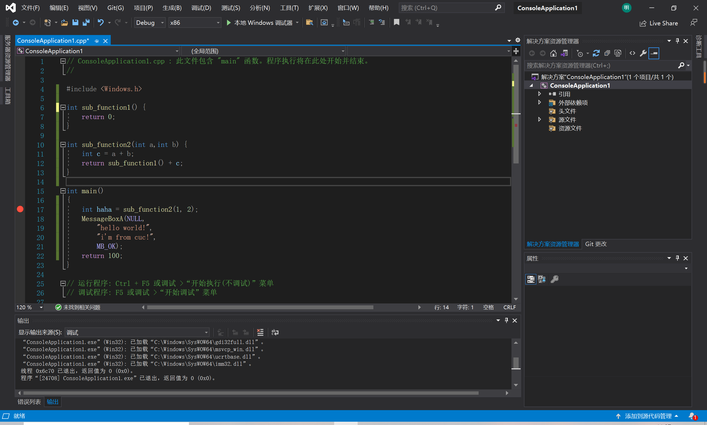
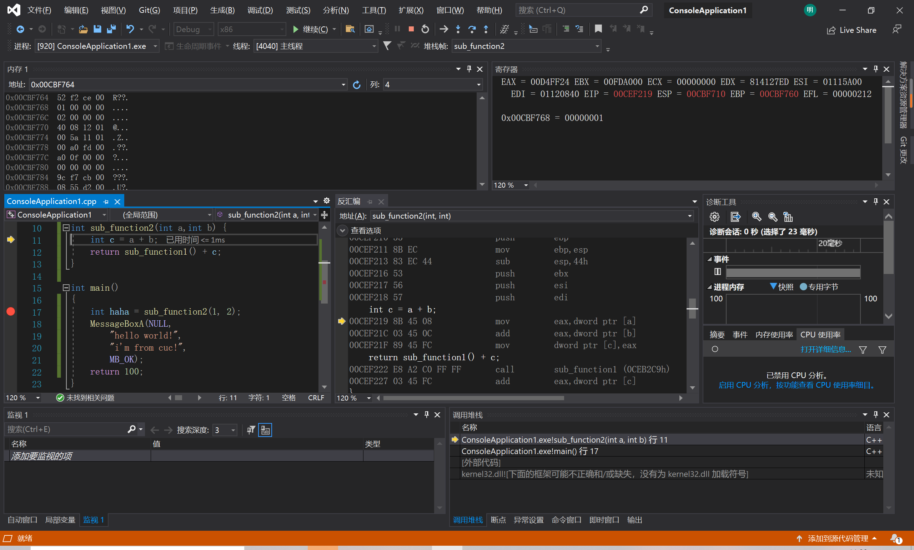

# 第一次实验
## 实验要求
1. 在VS中建立工程，修改编译选项，只保留/ZI(调试)和pdb文件路径两个选项，增加禁用安全检查选项(/GS-)。
2. 编译多个函数调用的示例代码。
3. 下断点调试运行，观察反汇编、寄存器、内存等几个调试时的信息。
4. 分析函数调用过程中栈的变化。解释什么是栈帧? ebp寄存器在函数调用过程中的变化过程，ebp寄存器的作用。
5. 函数局部变量和参数的保存位置、 访问方式是什么。
6. 多层的函数调用，栈的变化情况，解释未赋初始值的局部变量的值是如何形成的。
> 写为实验笔记(markdown格式)、发学委git仓库地址。

## 实验结果
1. 在VS中建立工程，修改编译选项，只保留/ZI(调试)和pdb文件路径两个选项，增加禁用安全检查选项(/GS-)。

2. 编译多个函数调用的示例代码。

3. 下断点调试运行，观察反汇编、寄存器、内存等几个调试时的信息。

4. 分析函数调用过程中栈的变化。解释什么是栈帧? ebp寄存器在函数调用过程中的变化过程，ebp寄存器的作用。
   - 栈是从高地址向低地址延伸的,每个函数的每次调用，都有它自己独立的一个栈帧，这个栈帧中维持着所需要的各种信息。寄存器ebp指向当前的栈帧的底部（高地址），寄存器esp指向当前的栈帧的顶部（地址地）。

5. 函数局部变量和参数的保存位置、 访问方式是什么。
   - 函数局部变量和参数的保存在栈里，通过esp指针进行访问。
6. 多层的函数调用，栈的变化情况，解释未赋初始值的局部变量的值是如何形成的。
   - 内存中该地址已有的值

## 实验问题
- 在修改编译选项时一直存在`/external:env:"EXTERNAL_INCLUDE"`选项,且当前选项中除去实验要求的两个选项之外全已删去。

## 实验总结
>push 入栈
>pop 出栈

>call 入栈一个数据？
>call 入栈下一条指令的地址。
- 在逆向工程时（从二进制程序分析程序的实现原理时）：
  1. 首先是进行反汇编 dumpbin /disasm 还有很多工具如IDA PRO
  2. 在反汇编中，call指令代表了所有函数调用。那么call的参数就一定是一个函数。
因此可以分析出，被逆向的程序中有多少函数，以及每个函数的范围。
  1. 在函数内部，所有的ebp+x就是参数，能够通过分析反汇编代码中的ebp+x，得到函数的参数。所有的ebp-x就是函数的局部变量。
- 由于函数的局部变量、参数和调用返回地址都保持在栈中，如果给局部赋值超过了存储空间的范围，可能会在函数返回时程序的执行异常（eip被覆盖和控制），这个就是最典型的缓冲区溢出漏洞。
